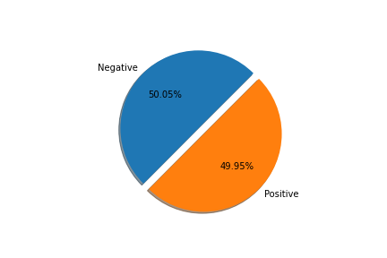
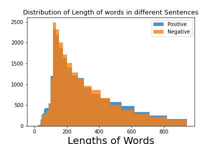
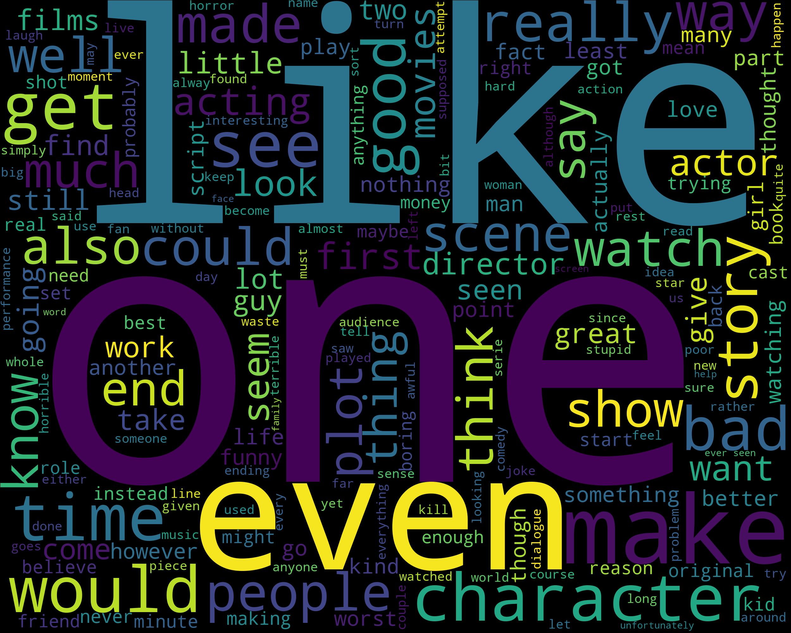
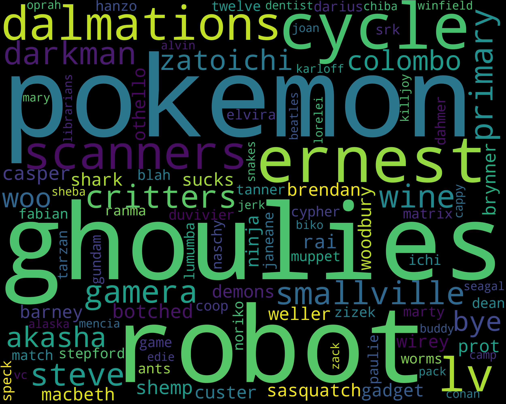
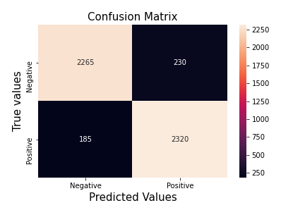
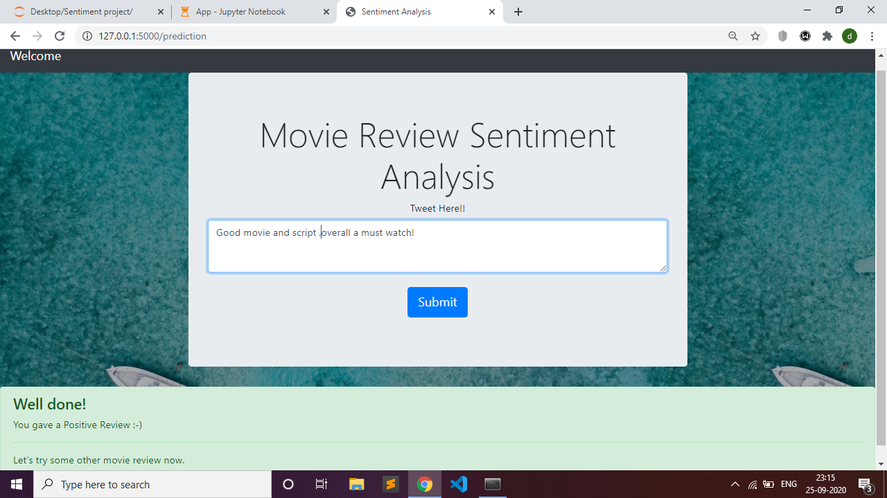
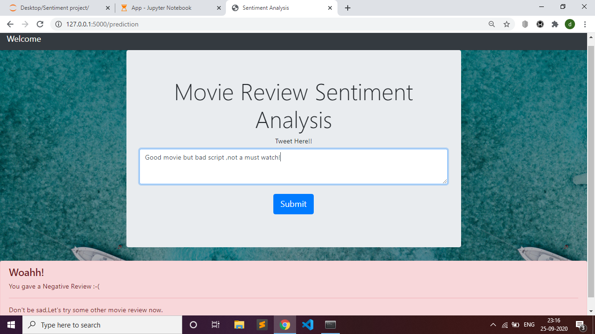

# Movie-review-Sentiment-Analysis App.  
This is an End-to-End machine learning Project.
### Installation Guide   

This project requires **Python** and the following Python libraries installed:

- [NumPy](http://www.numpy.org/)
- [Pandas](http://pandas.pydata.org/)
- [matplotlib](http://matplotlib.org/)
- [scikit-learn](http://scikit-learn.org/stable/)
- [Seaborn](https://seaborn.pydata.org/)
- [NLTK](https://www.nltk.org/)
- [Flask](https://flask.palletsprojects.com/)  
- [WordCloud](https://pypi.org/project/wordcloud/)

OR just simply clone the requirements.txt file from here and type `pip install -r requirements.txt` in the Command Line / IDE environment.  

You will also need to have software installed to run and execute a [Jupyter Notebook](http://ipython.org/notebook.html) or any other IDE of your choice.  

If you do not have Python installed yet, it is highly recommended that you install the [Anaconda](http://continuum.io/downloads) distribution of Python, which already has the above packages and more included. 

### Code

All the code is in the [Movie_review_Sentiment_analysis.ipynb](https://github.com/Dvboi/Movie-review-Sentiment-Analysis/blob/master/Movie_review_Sentiment_analysis.ipynb) notebook file.   

#### Imports and Data
Ok so first we do the [Imports](https://render.githubusercontent.com/view/ipynb?commit=99b206c9613e837546dbff13602fd802943056c7&enc_url=68747470733a2f2f7261772e67697468756275736572636f6e74656e742e636f6d2f4476626f692f4d6f7669652d7265766965772d53656e74696d656e742d416e616c797369732f393962323036633936313365383337353436646266663133363032666438303239343330353663372f4d6f7669655f7265766965775f53656e74696d656e745f616e616c797369732e6970796e62&nwo=Dvboi%2FMovie-review-Sentiment-Analysis&path=Movie_review_Sentiment_analysis.ipynb&repository_id=298562494&repository_type=Repository#IMPORTS)
and look at the data.The data was collected from [Kaggle](https://www.kaggle.com/columbine/imdb-dataset-sentiment-analysis-in-csv-format).   
Hmm,the data looks balanced...   
  
Ok it's good that we don't have to worry about data imbalance (which is rare in real-world scenarios), let's see if the length of sentences (in terms of words) is different
for positive and negative sentiment.  
   

As the length of sentences of both the classes have almost same distribution and overlap so this feature is not important.   

#### Visualizing text in data  
After some [Text Preprocessing](https://render.githubusercontent.com/view/ipynb?commit=99b206c9613e837546dbff13602fd802943056c7&enc_url=68747470733a2f2f7261772e67697468756275736572636f6e74656e742e636f6d2f4476626f692f4d6f7669652d7265766965772d53656e74696d656e742d416e616c797369732f393962323036633936313365383337353436646266663133363032666438303239343330353663372f4d6f7669655f7265766965775f53656e74696d656e745f616e616c797369732e6970796e62&nwo=Dvboi%2FMovie-review-Sentiment-Analysis&path=Movie_review_Sentiment_analysis.ipynb&repository_id=298562494&repository_type=Repository#Pre-processing-Text)
we visualize the text in movie reviews / docs.   

Here are some visualizations using [WordCloud](https://render.githubusercontent.com/view/ipynb?commit=99b206c9613e837546dbff13602fd802943056c7&enc_url=68747470733a2f2f7261772e67697468756275736572636f6e74656e742e636f6d2f4476626f692f4d6f7669652d7265766965772d53656e74696d656e742d416e616c797369732f393962323036633936313365383337353436646266663133363032666438303239343330353663372f4d6f7669655f7265766965775f53656e74696d656e745f616e616c797369732e6970796e62&nwo=Dvboi%2FMovie-review-Sentiment-Analysis&path=Movie_review_Sentiment_analysis.ipynb&repository_id=298562494&repository_type=Repository#Visualising-the-text-in-data) -   
  
  
**The Text present in the Positive reviews -**   
   
   
     
    
    
    
**The Text present in the Negative reviews -**   
     
       
       
     
   
      
Hmmm.... that's interesting that we saw word like **like** and **one** in both positive and negative sentiments.Well, that's because `I like the movie` and `I don't like the movie` both involve the word like but are in very different contexts and hence different meanings. Don't worry we'll take care of them in model building process using something called `N-grams`.
        
          
          
**Top 100 Rarest words in reviews -**   
    
      
   
     
        
**Top 100 most Common words in reviews -**   
   
      
    
    
       
#### Text Preprocessing   

We don't do much here except for providing our custom [Lemmatization](https://render.githubusercontent.com/view/ipynb?commit=99b206c9613e837546dbff13602fd802943056c7&enc_url=68747470733a2f2f7261772e67697468756275736572636f6e74656e742e636f6d2f4476626f692f4d6f7669652d7265766965772d53656e74696d656e742d416e616c797369732f393962323036633936313365383337353436646266663133363032666438303239343330353663372f4d6f7669655f7265766965775f53656e74696d656e745f616e616c797369732e6970796e62&nwo=Dvboi%2FMovie-review-Sentiment-Analysis&path=Movie_review_Sentiment_analysis.ipynb&repository_id=298562494&repository_type=Repository#Lemmatization-on-preprocessed-text--(this-was-passed-as-a-callable-to-tokenization-method-in-TF-IDF-vctorization))
function to the tokenizer variable in `TF-IDF Vectorizer`.   
Lemmatizing is actually reducing words like `walks` and `walking` to base form `walk`,thus reducing the dimensions of the data. Learn more [here](https://www.tutorialspoint.com/natural_language_toolkit/natural_language_toolkit_stemming_lemmatization.htm).   
     
         
#### Model Building   

Finally we're at the model building process. Here we build a [Pipeline](https://render.githubusercontent.com/view/ipynb?commit=99b206c9613e837546dbff13602fd802943056c7&enc_url=68747470733a2f2f7261772e67697468756275736572636f6e74656e742e636f6d2f4476626f692f4d6f7669652d7265766965772d53656e74696d656e742d416e616c797369732f393962323036633936313365383337353436646266663133363032666438303239343330353663372f4d6f7669655f7265766965775f53656e74696d656e745f616e616c797369732e6970796e62&nwo=Dvboi%2FMovie-review-Sentiment-Analysis&path=Movie_review_Sentiment_analysis.ipynb&repository_id=298562494&repository_type=Repository#Model-Building-(-Takes-30mins-to-train-on-normal-hardware))
which first fits and transforms our text reviews into a matrix of numbers that Computers can understand. How it works is that each word in the data present is assigned a fraction number which is the number of times it is present across the whole data divided by the number of reviews/docs it is present in. Head [here](https://en.wikipedia.org/wiki/Tf%E2%80%93idf#:~:text=In%20information%20retrieval%2C%20tf%E2%80%93idf,in%20a%20collection%20or%20corpus.)
for a thorough explaination.   
The next object in our Pipeline is obviously,the Model. We use a Logistic regression model with parameters - *ngram_range=(1,3) , n_jobs=-1 , max_iter=500*.   
The n-grams are used so that the model can classify between `I like it` and `I don't like it` by also noticing the context they are being used in and doesn't just simply classifies everything as positive on seeing the word - **like**.       
    
        
The model is trained on almost 40k movie reviews and has a really large Corpora with thousand of dimensions and takes almost half an hour to train on normal hardware.   
   
#### Metrics and Evaluation  
We Receive an [accuracy](https://render.githubusercontent.com/view/ipynb?commit=99b206c9613e837546dbff13602fd802943056c7&enc_url=68747470733a2f2f7261772e67697468756275736572636f6e74656e742e636f6d2f4476626f692f4d6f7669652d7265766965772d53656e74696d656e742d416e616c797369732f393962323036633936313365383337353436646266663133363032666438303239343330353663372f4d6f7669655f7265766965775f53656e74696d656e745f616e616c797369732e6970796e62&nwo=Dvboi%2FMovie-review-Sentiment-Analysis&path=Movie_review_Sentiment_analysis.ipynb&repository_id=298562494&repository_type=Repository#Let's-import-test-set-and-Evaluate-the-performance)
of almost 92% which is really good, and also reliable as we had balanced Dataset. Still in case if you have doubts, here's the Confusion Matrix -   
     
     
  
    
We also recieved [F1 Score](https://en.wikipedia.org/wiki/F1_score) of 92%.   
   
#### Saving and Productionization   

We saved the model using [Pickle](https://render.githubusercontent.com/view/ipynb?commit=99b206c9613e837546dbff13602fd802943056c7&enc_url=68747470733a2f2f7261772e67697468756275736572636f6e74656e742e636f6d2f4476626f692f4d6f7669652d7265766965772d53656e74696d656e742d416e616c797369732f393962323036633936313365383337353436646266663133363032666438303239343330353663372f4d6f7669655f7265766965775f53656e74696d656e745f616e616c797369732e6970796e62&nwo=Dvboi%2FMovie-review-Sentiment-Analysis&path=Movie_review_Sentiment_analysis.ipynb&repository_id=298562494&repository_type=Repository#Saving-and-then-loading-a-model)
 ,the size of the saved model is approximately 350MB. You can clone the logistic_model.pkl from the repository instead of going through the hassle of training it.   
    
  The Model is then deployed using the Flask frontend Local server using **HTML,CSS and BOOTSTRAP 4**.   
  You can run `App.ipynb` file if you are using the Jupyter notebook or `app.py` file for opening the flask website on your pc if you are using a normal IDE like VSCode/sublime etc ,both have been provided.
     
         
             
#### How the Website looks:   
   
      
**Postive Review**  
        
          
   
             
               
 **Negative Review**  
          
              

      
         
            
      
 **Note-** The project wasn't productionized on Heroku because it's size (because of the model size) exceeded their platform's slug size of 300mb. Other cloud Platforms needed Credit-Card. Thus, it's best to run the model locally.   
     
          
            
So,this was my first end-to-end model,hope you liked it!.  
 Want to connect? Here's my:   
 
 .     
 
       
        
### Happy Learning!!!

